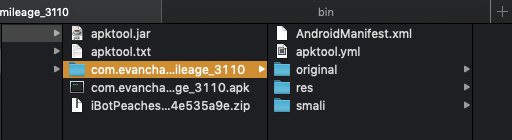

# Parcial 2 - Pruebas automáticas de software

## Recursos
Para la realización de las pruebas se utiliza la máquina Macbook pro de Apple con las siguientes configuraciones y versiones de las tecnologías asociadas:

**MacBook pro 13**

procesador 2.5 GHz Intel Core i5, ram 12 GB 1333 MHz DDR3, Disco duro 500Gb, graphics Intel HD Graphics 4000 1536 MB.

**Software**

MacOS: versión 10.14.1 (Mojave)
Android Studio:  versión 3.1.4
calabash-android: versión 0.9.8
cucumber: versión 3.1.2
node: versión 8.10
ruby: versión 2.3.7

**Emulador**

AVD Manager - Android Studio
Nexus 5, Sistema operativo Android Oreo versión 8.0 cpu(x86), display 1080x1920

## Estrategia

Se usará para las pruebas la gema de ruby Android-calabash que facilita la escritura y la descripción de los casos de prueba usando como lenguaje o tecnología cucumber. Esto facilita enormemente las pruebas y optimiza el tiempo de elaboración de los escenarios de prueba.

## Desarrollo

Se procede a realizar el firmado de la aplicación para su posterior instalación.

Se crea el proyecto y haciendo uso de calabash-android  

    $ calabash-android gen

Se realiza el procedimiento inicialmente para la línea base de la aplicación, es decir, la aplicación se deja al nivel de la carpeta feature y se ejecuta el comando

    $ calabash-android resign com.evancharlton.mileage_3110.apk

Inicialmente se realiza la instalación del apk en el emulador.

    $ calabash-android run com.evancharlton.mileage_3110.apk

Sin embargo al ejecutar el comando, se presenta un error. Averiguando el origen se establece que Calabash necesita los permisos necesarios del app para ejecutar los steps.

## Decoding

Se requiere en este punto decompilar el apk 

y convertir el empaquetado a código fuente nuevamente

modificar el archivo `manifest.xml` para adiciónar la línea

    ...
    <uses-permission android:name="android.permission.INTERNET"/>
    ...

y compilar nuevamente el paquete para generar el apk. Para tal fin se ejecuta el comando

    $ java -jar apktool.jar b .

De esta forma, se compila el código nuevamente y genera el apk en la carpeta `dist/` de la ubicación actual.

Ahora el apk está listo para ser firmado nuevamente y generar el certificado necesario para instalar la aplicación en el emulador. Para este punto se ejecuta el comando

    $ calabash-android resign com.evancharlton.mileage_3110.apk

Después del firmado de la aplicación, se ejecuta el comando

    $ calabash-android run com.evancharlton.mileage_3110.apk

Este comando, instala la aplicación en el emulador y corre el test de prueba para seleccionar la opción `Vehicles` dentro del app.

Se crean los features que permiten a través de diferentes escenarios probar la creación, actualización y eliminación de vehículo y fillup.

Dichos features, se ejecutan por cada grupo de mutantes para establecer o encontrar el error en cada una de las versiones tomadas.

La línea base de la aplicación genera ejecutando los escenarios, los siguientes screenshots a comparar:

### Fillup

### Vehicle

# Resultado de la ejecución de ls pruebas de fillup y vehicle.

## Mutantes 1-14 NULL_INPUT_STREAM

**Log**

    makitos-mbp:baseline makito$ calabash-android resign com.evancharlton.mileage_3110.apk

    Warning:
    The JKS keystore uses a proprietary format. It is recommended to migrate to PKCS12 which is an industry standard format using "keytool -importkeystore -srckeystore/Users/makito/.android/debug.keystore -destkeystore /Users/makito/.android/debug.keystore -deststoretype pkcs12".
    makitos-mbp:baseline makito$ calabash-android run com.evancharlton.mileage_3110.apk
    No test server found for this combination of app and calabash version. Recreating test server.

    Warning:
    The JKS keystore uses a proprietary format. It is recommended to migrate to PKCS12 which is an industry standard format using "keytool -importkeystore -srckeystore /Users/makito/.android/debug.keystore -destkeystore /Users/makito/.android/debug.keystore -deststoretype pkcs12".
    Done signing the test server. Moved it to test_servers/db72ec6159701bb706348b9c27866459_0.9.8.apk
    Feature: fillup Scenarios

    Success
    Success
    Scenario: As a valid user I can create fillup                    # features/fillup.feature:3
        When I press "Fillup"                                          # calabash-android-0.9.8/lib/calabash-android/steps/press_button_steps.rb:17
        Then I enter "9800" into input field number 1                  # calabash-android-0.9.8/lib/calabash-android/steps/enter_text_steps.rb:9
        Then I enter "5" into input field number 2                     # calabash-android-0.9.8/lib/calabash-android/steps/enter_text_steps.rb:9
        Then I enter "134000" into input field number 3                # calabash-android-0.9.8/lib/calabash-android/steps/enter_text_steps.rb:9
        Then I press view with id "date"                               # calabash-android-0.9.8/lib/calabash-android/steps/press_button_steps.rb:13
        Then I set the date to "08-12-2018" on DatePicker with index 1 # calabash-android-0.9.8/lib/calabash-android/steps/date_picker_steps.rb:2
        Then I press view with id "button1"                            # calabash-android-0.9.8/lib/calabash-android/steps/press_button_steps.rb:13
        Then I press view with id "partial"                            # calabash-android-0.9.8/lib/calabash-android/steps/press_button_steps.rb:13
        Then I press view with id "save_btn"                           # calabash-android-0.9.8/lib/calabash-android/steps/press_button_steps.rb:13
        Then I press "History"                                         # calabash-android-0.9.8/lib/calabash-android/steps/press_button_steps.rb:17
        Then I take a screenshot                                       # calabash-android-0.9.8/lib/calabash-android/steps/screenshot_steps.rb:9
        Then I should see text containing "12/8/18"                    # calabash-android-0.9.8/lib/calabash-android/steps/assert_steps.rb:13

    Scenario: As a valid user I can edit fillup     # features/fillup.feature:17
        When I press "History"                        # calabash-android-0.9.8/lib/calabash-android/steps/press_button_steps.rb:17
        Then I should see text containing "12/8/18"   # calabash-android-0.9.8/lib/calabash-android/steps/assert_steps.rb:13
        Then I long press "12/8/18" and select "Edit" # calabash-android-0.9.8/lib/calabash-android/steps/context_menu_steps.rb:8
        Warning: This predefined step is deprecated.
        Then I clear input field number 2             # calabash-android-0.9.8/lib/calabash-android/steps/enter_text_steps.rb:21
        Then I enter "10" into input field number 2   # calabash-android-0.9.8/lib/calabash-android/steps/enter_text_steps.rb:9
        Then I hide the keyboard                      # features/step_definitions/calabash_steps.rb:3
        Then I wait                                   # calabash-android-0.9.8/lib/calabash-android/steps/progress_steps.rb:5
        Then I press view with id "save_btn"          # calabash-android-0.9.8/lib/calabash-android/steps/press_button_steps.rb:13
        Then I take a screenshot                      # calabash-android-0.9.8/lib/calabash-android/steps/screenshot_steps.rb:9
        Then I should see text containing "10.00 g"   # calabash-android-0.9.8/lib/calabash-android/steps/assert_steps.rb:13

    Feature: Vehicle Scenarios

    Scenario: As a valid user I can create new car                      # features/vehicle.feature:3
        When I press "Vehicles"                                           # calabash-android-0.9.8/lib/calabash-android/steps/press_button_steps.rb:17
        Then I press the menu key                                         # calabash-android-0.9.8/lib/calabash-android/steps/navigation_steps.rb:5
        # Then I wait
        Then I press "Add new vehicle"                                    # calabash-android-0.9.8/lib/calabash-android/steps/press_button_steps.rb:17
        Then I enter "Mazda3" into input field number 1                   # calabash-android-0.9.8/lib/calabash-android/steps/enter_text_steps.rb:9
        Then I enter "2019" into input field number 2                     # calabash-android-0.9.8/lib/calabash-android/steps/enter_text_steps.rb:9
        Then I enter "Japón" into input field number 3                    # calabash-android-0.9.8/lib/calabash-android/steps/enter_text_steps.rb:9
        Then I enter "Grand Touring" into input field number 4            # calabash-android-0.9.8/lib/calabash-android/steps/enter_text_steps.rb:9
        Then I enter "Con tecnología SkyActive" into input field number 5 # calabash-android-0.9.8/lib/calabash-android/steps/enter_text_steps.rb:9
        # Then I press view with id "type"
        # Then I press list item number 1
        Then I scroll down                                                # calabash-android-0.9.8/lib/calabash-android/steps/navigation_steps.rb:36
        Then I press view with id "distance"                              # calabash-android-0.9.8/lib/calabash-android/steps/press_button_steps.rb:13
        Then I press "Kilometers"                                         # calabash-android-0.9.8/lib/calabash-android/steps/press_button_steps.rb:17
        Then I scroll down                                                # calabash-android-0.9.8/lib/calabash-android/steps/navigation_steps.rb:36
        Then I press view with id "economy"                               # calabash-android-0.9.8/lib/calabash-android/steps/press_button_steps.rb:13
        Then I press "Km / Gallon"                                        # calabash-android-0.9.8/lib/calabash-android/steps/press_button_steps.rb:17
        Then I scroll down                                                # calabash-android-0.9.8/lib/calabash-android/steps/navigation_steps.rb:36
        Then I press view with id "save_btn"                              # calabash-android-0.9.8/lib/calabash-android/steps/press_button_steps.rb:13
        Then I take a screenshot                                          # calabash-android-0.9.8/lib/calabash-android/steps/screenshot_steps.rb:9
        Then I should see text containing "Mazda3"                        # calabash-android-0.9.8/lib/calabash-android/steps/assert_steps.rb:13

    Scenario: As a valid user I can edit Mazda3 car                                 # features/vehicle.feature:26
        When I press "Vehicles"                                                       # calabash-android-0.9.8/lib/calabash-android/steps/press_button_steps.rb:17
        Then I should see text containing "Mazda3"                                    # calabash-android-0.9.8/lib/calabash-android/steps/assert_steps.rb:13
        Then I long press "Mazda3" and select "Edit"                                  # calabash-android-0.9.8/lib/calabash-android/steps/context_menu_steps.rb:8
        Warning: This predefined step is deprecated.
        # Then I press press the "Mazda3"
        Then I clear input field number 5                                             # calabash-android-0.9.8/lib/calabash-android/steps/enter_text_steps.rb:21
        Then I enter "Descripción actualizada del vehículo" into input field number 5 # calabash-android-0.9.8/lib/calabash-android/steps/enter_text_steps.rb:9
        Then I hide the keyboard                                                      # features/step_definitions/calabash_steps.rb:3
        Then I wait                                                                   # calabash-android-0.9.8/lib/calabash-android/steps/progress_steps.rb:5
        Then I scroll down                                                            # calabash-android-0.9.8/lib/calabash-android/steps/navigation_steps.rb:36
        Then I scroll down                                                            # calabash-android-0.9.8/lib/calabash-android/steps/navigation_steps.rb:36
        Then I press view with id "save_btn"                                          # calabash-android-0.9.8/lib/calabash-android/steps/press_button_steps.rb:13
        Then I take a screenshot                                                      # calabash-android-0.9.8/lib/calabash-android/steps/screenshot_steps.rb:9
        Then I should see text containing "Descripción actualizada del vehículo"      # calabash-android-0.9.8/lib/calabash-android/steps/assert_steps.rb:13

    Scenario: As a valid user I set Mazda3 has default car # features/vehicle.feature:41
        When I press "Vehicles"                              # calabash-android-0.9.8/lib/calabash-android/steps/press_button_steps.rb:17
        Then I should see text containing "Mazda3"           # calabash-android-0.9.8/lib/calabash-android/steps/assert_steps.rb:13
        Then I long press "Mazda3" and select item number 1  # calabash-android-0.9.8/lib/calabash-android/steps/context_menu_steps.rb:1
        Warning: This predefined step is deprecated.
        Then I take a screenshot                             # calabash-android-0.9.8/lib/calabash-android/steps/screenshot_steps.rb:9

    Scenario: As a valid user I can delete default car    # features/vehicle.feature:47
        When I press "Vehicles"                             # calabash-android-0.9.8/lib/calabash-android/steps/press_button_steps.rb:17
        Then I should see text containing "Default vehicle" # calabash-android-0.9.8/lib/calabash-android/steps/assert_steps.rb:13
        # Then I long press "Default vehicle" and select "Delete"
        Then I long press "Default vehicle"                 # calabash-android-0.9.8/lib/calabash-android/steps/context_menu_steps.rb:15
        Then I press "Edit"                                 # calabash-android-0.9.8/lib/calabash-android/steps/press_button_steps.rb:17
        Then I hide the keyboard                            # features/step_definitions/calabash_steps.rb:3
        Then I wait                                         # calabash-android-0.9.8/lib/calabash-android/steps/progress_steps.rb:5
        Then I press the menu key                           # calabash-android-0.9.8/lib/calabash-android/steps/navigation_steps.rb:5
        Then I press "Delete"                               # calabash-android-0.9.8/lib/calabash-android/steps/press_button_steps.rb:17
        Then I press "OK"                                   # calabash-android-0.9.8/lib/calabash-android/steps/press_button_steps.rb:17
        Then I don't see "Default vehicle"                  # calabash-android-0.9.8/lib/calabash-android/steps/assert_steps.rb:27
        Then I take a screenshot                            # calabash-android-0.9.8/lib/calabash-android/steps/screenshot_steps.rb:9

    6 scenarios (6 passed)
    67 steps (67 passed)
    4m13.207s

No se presenta ningún Error. Los casos de prueba se ejecutan correctamente.

